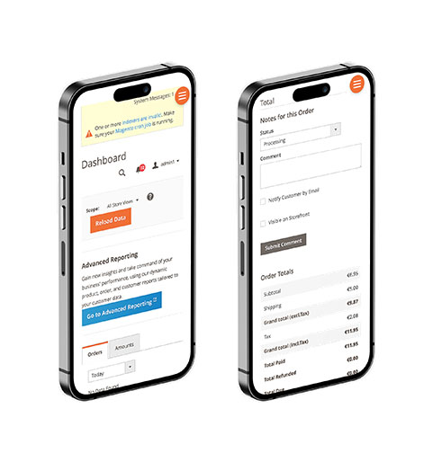

# Magento Responsive Admin Theme


The default Magento 2 Admin interface lacks responsiveness, making it difficult to use on mobile devices. To address this issue, I took the initiative to create the Magento Responsive Admin Theme, as I wasn't able to find any free one.

## Overview
This theme is an extension of the default Magento 2 admin theme, designed to make the admin panel responsive and accessible on mobile devices. While it may not be flawless, it significantly improves usability.\
\
For now, there are few lines added in less files and some basic javascript to handle menu toggling. It might be improved over time to make things look better.

### Installation
The easiest method of installation is by using Composer:
```
composer require flexydev/theme-responsive-adminhtml-backend
```
Alternatively, you can download the repository and place it in the `app/design/adminhtml/Flexydev/responsive` directory. To activate the theme, you can either use the provided module, which handles the activation process: [Magento Responsive Admin Module](https://github.com/mzymela/magento2-responsive-admin-module), or manually add the necessary configuration to your existing module.

### Extending
If you wish to extend this theme's functionality, you can create your own child theme in the `app/design/adminhtml/{Vendor}/{theme}` directory. In your child theme, you can selectively override or extend only the files you need. As there are not many changes in this theme, you can easily copy the required files and customize them according to your requirements. Don't forget to update your configuration to use your new theme.

#### Contribute
Feel free to submit pull requests with your improvements.
